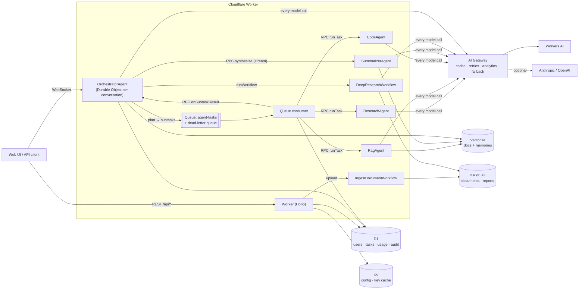

# EdgeMind

**Live demo: https://edgemind.edgemind.workers.dev**

**A multi-agent AI backend running entirely on Cloudflare's edge.** An orchestrator agent plans each request, fans subtasks out to specialist agents over a queue, and streams one combined answer back over WebSockets, with no servers to manage.

Each agent is a stateful Durable Object built with the Cloudflare Agents SDK. Long-running jobs run as durable Workflows. Every model call goes through AI Gateway. The whole stack runs on the Workers **Free** plan, with no payment card required.

> TypeScript · Workers · Agents SDK · Durable Objects · Workers AI · AI Gateway · Vectorize · D1 · KV / R2 · Queues · Workflows · Hono

---

## Live deployment

Deployed at **https://edgemind.edgemind.workers.dev** on a Cloudflare Workers **Free** account (no payment card; files stored in KV).

**Try it:** open the link (a guest session is created automatically), click **Research + code**, and expand the agent trace to watch the plan, each agent's status and the streamed answer. Switch to **Deep research** mode for a multi-round report you can download.

**Verified against the live site with real Workers AI models** (`npm run smoke -- https://edgemind.edgemind.workers.dev`):

| Scenario | Path | Result |
|---|---|---|
| "What is Cloudflare Workers AI?" | Planner chose `direct` | Answered in **9 s**, 412 tokens, ~$0.00005 |
| "Look up how Durable Objects work, then write a TypeScript counter" | Planner chose `delegate`: research → code (dependent) → summarizer, over Queues | Answered in **72 s**, 4,639 tokens, ~$0.001 |
| Upload a `.md` file, then ask "what is the project codename and launch date?" | Ingest Workflow → planner chose `delegate`: rag → summarizer | Document ready in **9.6 s**; correct answer with a citation to the file, **25 s** |
| Deep research mode: "Edge AI inference on CDNs" | `DeepResearchWorkflow`: 3 rounds, 9 searches, report saved and downloadable | Report with **24 sources** in **100 s** |
| Health check | D1, KV, file storage (KV), Vectorize | All OK |

**Known limitation:** delegated runs are slow (about a minute). The time goes on dependent agents running one after another (research, then code, then synthesis), each one a queue hop plus a model call. The run timeout is 120 s, so a heavier request can finish with partial results.

## What it does

- **Planning.** The orchestrator asks a model to choose a mode: answer directly, delegate to 1–4 specialist subtasks (with dependencies between them), or start a deep research job.
- **Specialist agents**, one Durable Object per user per type:
  - **Research** searches the web (Wikipedia by default, Tavily if you add a key) and writes cited findings.
  - **RAG** answers from the user's uploaded documents using hybrid retrieval: D1 full-text search (BM25) plus Vectorize semantic search, merged with reciprocal rank fusion. New uploads are searchable immediately, before Vectorize finishes indexing.
  - **Code** writes, explains and reviews code, using the other agents' output as context.
  - **Summarizer** merges every result into one cited answer, streamed token by token. It also extracts durable facts about the user into long-term memory.
- **Event-driven fan-out.** Subtasks travel over Cloudflare Queues. Failed tasks retry with exponential backoff. After the last retry they go to a dead-letter queue, and the run finishes with partial results instead of hanging.
- **Durable execution.** Document ingestion and multi-round deep research run as Workflows. Every search, model call and embedding batch is a separate step, so a crash resumes where it stopped.
- **Real-time UI.** A built-in web client shows the live agent trace (plan → each agent's status → streamed answer with linked citations).
- **Production concerns.** Guest JWTs and hashed API keys, per-tenant isolation, rate limiting, daily token budgets, usage and cost tracking, audit log, structured logs with trace IDs, and health checks.

## Architecture



### Lifecycle of a chat turn

1. The client opens `wss://…/agents/orchestrator-agent/<userId>__<conversationId>?token=…`. The Worker checks the token, and that the conversation belongs to that user, before upgrading.
2. The orchestrator stores the message, checks the rate limit and the daily token budget, and schedules a run timeout. It then pushes `planRun` onto the Agents SDK's durable in-agent queue, so the WebSocket handler returns immediately.
3. The planner gets the request, recent history, recalled memories and the user's document count. It returns validated JSON. Invalid output gets one repair attempt, then falls back to a direct answer.
4. Subtasks whose dependencies are met go to Cloudflare Queues. The consumer marks each one running, calls the right specialist over Durable Object RPC, and reports the result back. Specialists are idempotent by task ID, because queue delivery is at-least-once.
5. When every subtask has settled (completed, failed or timed out), the orchestrator renumbers each agent's citations into one source list. It then streams the Summarizer's answer to every connected client.
6. After the answer, the Summarizer extracts up to 3 durable facts and stores them in Vectorize, where later conversations can recall them.

### Design decisions

| Decision | Why |
|---|---|
| Orchestrator per *conversation*, specialists per *user* | Conversations scale out independently. Each user's specialists keep their own task history and stay isolated from other users. |
| Cloudflare Queues for fan-out, DO RPC for results | Queues give retries, backoff and a DLQ for unreliable work (web, LLMs). RPC gives the orchestrator the result immediately. |
| Agents SDK `queue()` / `schedule()` inside the orchestrator | Planning and synthesis survive eviction. Timeouts are durable alarms, not `setTimeout`. |
| Workflows only for long multi-step jobs | Per-step retries and resumability where they matter (ingestion, deep research). Short subtasks skip the step overhead. |
| All model calls through one `LLMClient` | One place for AI Gateway metadata, fallback, usage accounting, and an offline fake used by tests. |
| Vectorize namespace = user ID | Tenant isolation is enforced by the index, not just by a filter. |
| Hybrid retrieval (FTS5 + Vectorize) | Vectorize applies writes asynchronously (seconds to minutes), so keyword search makes fresh uploads answerable immediately; it also catches exact terms (codes, names) that embeddings miss. |
| Model IDs in KV | Swap models (for example when a model goes Paid-only) without a deploy. |

## Quick start (no Cloudflare account needed)

```bash
npm install
npm run db:migrate:local
cp .dev.vars.example .dev.vars   # set JWT_SECRET and ADMIN_TOKEN to any random strings
npm run dev:offline              # http://localhost:8787
```

Offline mode replaces Workers AI with a deterministic stand-in model and replaces Vectorize with a D1-backed cosine search. Every flow still runs for real, including queues, Durable Objects, Workflows, D1 and KV, so you can try the UI and the agent pipeline without an account.

## Deploy to Cloudflare

```bash
npx wrangler login
npm run setup
```

`scripts/setup.sh` creates the D1 database, KV namespace, Vectorize index (with metadata indexes) and both queues. It also writes the resource IDs into `wrangler.jsonc`, applies migrations, deploys, and sets `JWT_SECRET` / `ADMIN_TOKEN`. It is safe to re-run. AI Gateway uses the `default` gateway, which Cloudflare creates automatically on first use.

Optional secrets:

```bash
npx wrangler secret put ANTHROPIC_API_KEY   # Claude as fallback model, via AI Gateway
npx wrangler secret put OPENAI_API_KEY      # OpenAI as fallback model, via AI Gateway
npx wrangler secret put TAVILY_API_KEY      # better web search for the research agent
```

Verify the deployment end to end:

```bash
npm run smoke -- https://edgemind.<your-subdomain>.workers.dev
```

### File storage: KV by default, R2 optional

Uploaded documents and research reports go through a small `FileStore` interface ([`src/lib/files.ts`](src/lib/files.ts)). By default it uses KV, so the project deploys on a Free account without enabling R2, which needs a payment card. To use R2 instead, add this to `wrangler.jsonc` and redeploy; no code changes are needed:

```jsonc
"r2_buckets": [{ "binding": "FILES", "bucket_name": "edgemind-files" }]
```

### Free plan fit

| Limit (Workers Free) | How EdgeMind stays inside it |
|---|---|
| 10,000 Workers AI neurons/day | Per-user daily token budget (guest 20k tokens), small Free-plan models, model "thinking" disabled, gateway caching |
| 10 ms CPU per invocation | Waiting on models and the network does not count; CPU-heavy work (chunking) runs in Workflow steps |
| 10,000 queue operations/day | At most 4 subtasks per request |
| 100 concurrent Workflow instances | Deep research is opt-in; it is capped at 3 rounds |
| KV: 1,000 writes/day, 25 MiB per value | Uploads capped at 10 MB; each upload costs 2 writes (original + extracted text) |

## Configuration

Runtime config lives in KV and is merged over the defaults in [`src/lib/config.ts`](src/lib/config.ts):

```bash
npx wrangler kv key put --binding KV config:models '{"summarizer":"@cf/zai-org/glm-4.7-flash"}' --remote
npx wrangler kv key put --binding KV config:limits '{"guestDailyTokens":50000,"maxSubtasks":3}' --remote
```

Model fallback order for each call: the configured Workers AI model, then the fallback Workers AI model, then Anthropic (if a key is set), then OpenAI (if a key is set). All of them go through AI Gateway, with retries and per-user metadata (`userId`, `agent`, `purpose`, `conversationId`, `traceId`) for cost analytics.

## API

All `/api/*` routes except `health` and `session` need `Authorization: Bearer <guest JWT | API key>`.

| Method | Route | Description |
|---|---|---|
| GET | `/api/health` | Probes D1, KV, file storage, Vectorize |
| POST | `/api/session` | New guest token (send an existing one to refresh it) |
| GET | `/api/me` | Caller, tokens used today, daily budget |
| GET / POST | `/api/conversations` | List / create conversations (returns `agentPath` for the WebSocket) |
| GET | `/api/conversations/:id/tasks` | Every subtask run in a conversation |
| POST | `/api/documents` | Upload (multipart `file`: txt, md, csv, json, html, pdf, docx; up to 10 MB) |
| GET / DELETE | `/api/documents[/:id]` | List, inspect, delete (removes chunks and vectors) |
| GET / DELETE | `/api/memories[/:id]` | Long-term memories about the caller |
| GET | `/api/reports/:runId` | Markdown report from deep research |
| GET | `/api/usage` | Tokens, estimated cost, per agent and model, recent calls |
| POST / DELETE | `/api/admin/keys[/:id]` | Issue / revoke API keys (`Bearer $ADMIN_TOKEN`) |
| GET | `/api/admin/audit` | Audit log |

### WebSocket protocol

Client → server:

```json
{ "type": "chat", "text": "Compare vector databases for RAG", "mode": "auto" }
```

`mode` is `"auto"` or `"deep"`. Server → client events:

| Event | Meaning |
|---|---|
| `history` | Recent messages, sent on connect |
| `run_started` | A run began (echoed to every tab) |
| `plan` | Mode, rationale, subtasks and dependencies |
| `subtask` | Status change: `queued` → `running` → `completed` / `failed` / `timed_out` |
| `research_progress` | Deep research step and progress |
| `token` | Streamed answer text |
| `final` | Full answer, merged sources, optional `reportUrl` |
| `error` | `rate_limited`, `budget_exceeded`, `run_in_progress`, `run_failed`, … |

Every event carries a `runId`. Log lines carry the matching `traceId`, so you can follow one request across agents, queue messages and workflow steps in Workers Logs.

## Testing

```bash
npm test          # 44 tests in the real Workers runtime (workerd + Miniflare)
npm run typecheck
```

- **Unit:** plan validation and cycle breaking, DAG readiness, chunking, JWT (tampering and expiry), API keys, SSE stream parsing, citation renumbering.
- **Integration:** auth and tenant isolation, rate limiting, API-key lifecycle, document ingestion through the Workflow into vectors, a direct run, a delegated run with dependencies over the real queue, a dead-letter run that finishes with partial results, a deep-research Workflow writing its report to file storage, memory across conversations, history replay on reconnect.

## Project layout

```
src/
  index.ts              Worker entry: agent routing + auth gate, Hono app, queue handler, exports
  agents/               orchestrator, specialist base, research, rag, code, summarizer, planner, citations
  workflows/            IngestDocumentWorkflow, DeepResearchWorkflow
  queue/consumer.ts     subtask consumer + dead-letter handling
  llm/                  LLMClient: AI Gateway client with fallback, offline fake, prompts, parsing
  memory/               chunker, vector store (Vectorize / offline)
  research/             web search + research step shared by agent and workflow
  auth/                 HS256 JWT, API keys, principal resolution
  api/                  REST routes
  lib/                  config, file storage (KV/R2), usage and budget, audit, logger, errors, types
public/                 web UI (no build step)
migrations/             D1 schema
test/                   unit + integration tests
scripts/                setup.sh, smoke.mjs, dev-offline.mjs
```

## License

MIT
